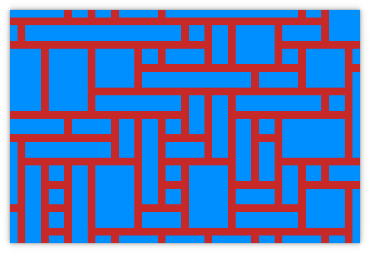

# Wave Function Collapse

A simple implementation of the wave function collapse algorithm using python and pygame.

## Usage

1. Clone the source code.
2. *Optional:* Create and activate a python virtualenv: `virtualenv .venv && source .venv/bin/activate`
3. Install dependencies via pip: `pip install -r requirements.txt`
4. Run the demo: `python wfc.py`
5. Observe randomly generated goodness.

## Controls

- `r`: Regenerate the grid.
- `ESC` or `q`: Quit the demo.

## Further Reading

- The original "paper" and implementation: https://github.com/mxgmn/WaveFunctionCollapse
- A video tutorial by Daniel Shiffman: https://www.youtube.com/watch?v=rI_y2GAlQFM
